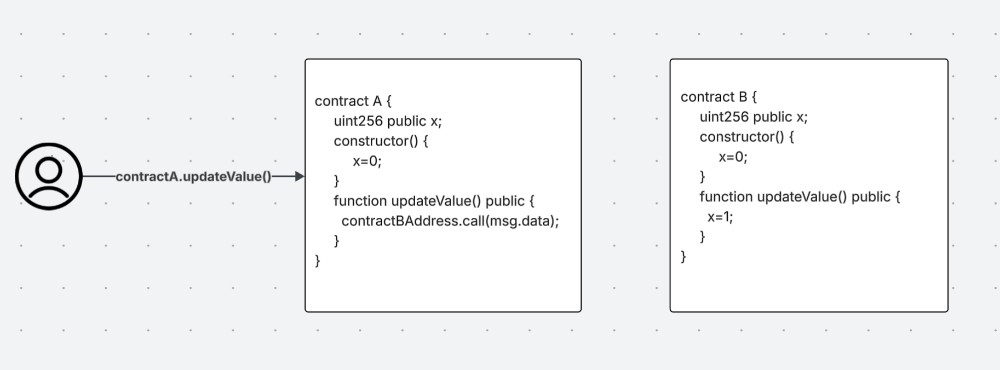

# Delegate Challenge

## Objective

1. We need to claim ownership of this smart contract

## Challenge: Claiming Ownership

In Solidity, there is a special way to call and execute a function, which is through `delegatecall`.
- delegatecall is similar to an ordinary message call, the only difference is that the context of the execution of the call is the caller's context and not the recipient's context, with `msg.sender` and `msg.value` stay unchanged.

This is the closest definition to a library in solidity, you can compare this to loading code from an external smart contract and executing it in the context of the current smart contract at call time.

as we see in the diagram above when triggering contractA's updateValue, it executes the logic of contract B's updateValue.

So the result after the call would be:
- __contract A => x = 1__
- __contract B => x = 0__

## Implementation

The easiest way to claim ownership of this contract, is to __call the Delegation contract__ with `pwn()` function, it would not match any current function's signature (since there are no functions to start with), __it will then execute the fallback function__. Thank to the delegactecall, the original `msg.data` that contains `pwn()` signature would be sent to __Delegate__ that will assign execute `owner = msg.sender` in the __Delegation context__.

Please refer to `./DelegationExploit.sol` for the explout implementation.

## How to Avoid

Make sure when using the `delegatecall` to know the external contract well, and the functions it can execute. The solution to this challenge would be to check if the caller is trying to call `pwn()` and `revert` if that is the case.

